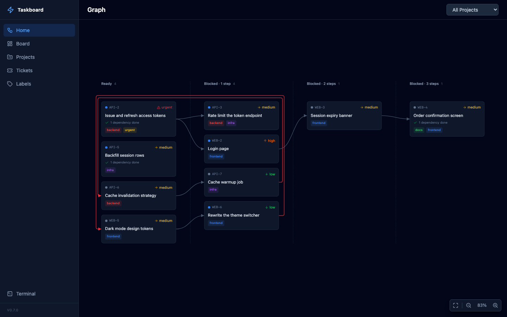
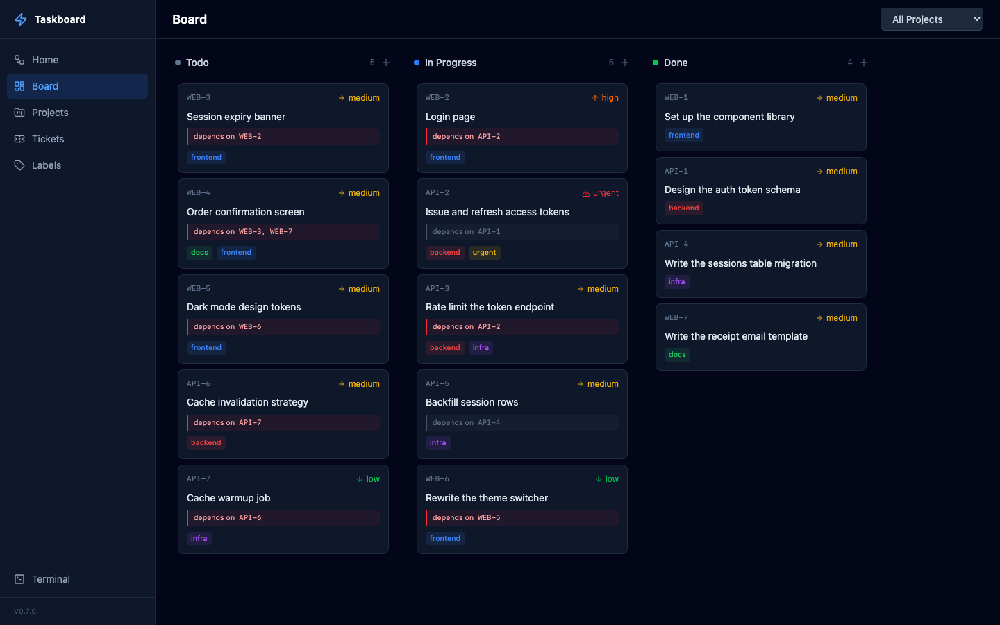
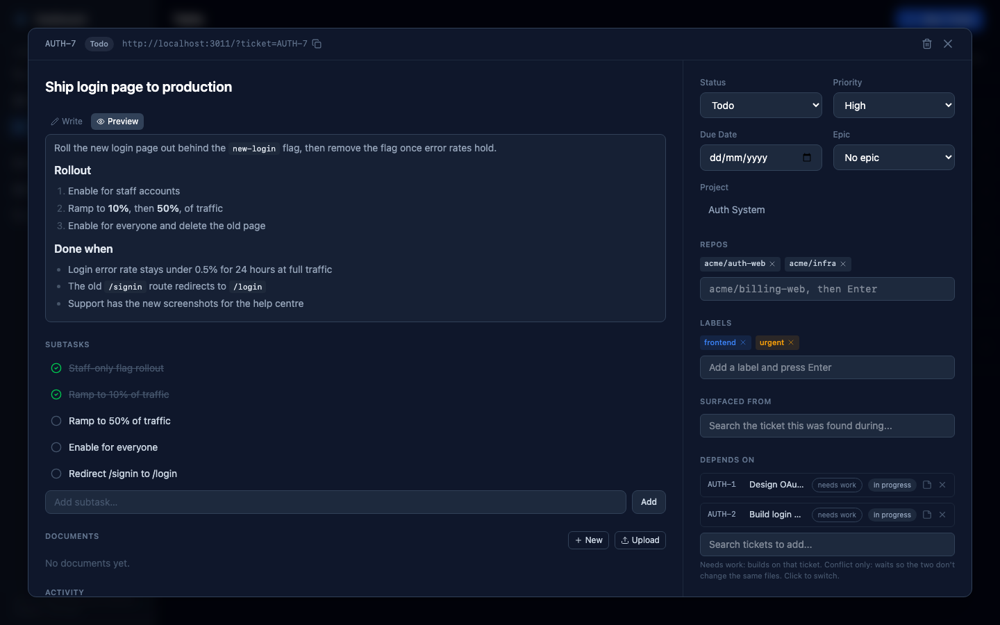
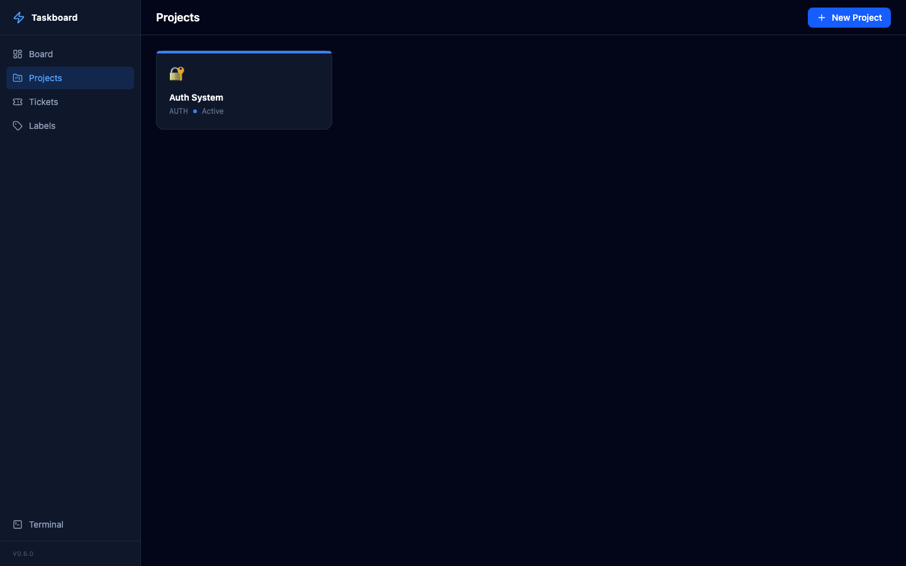
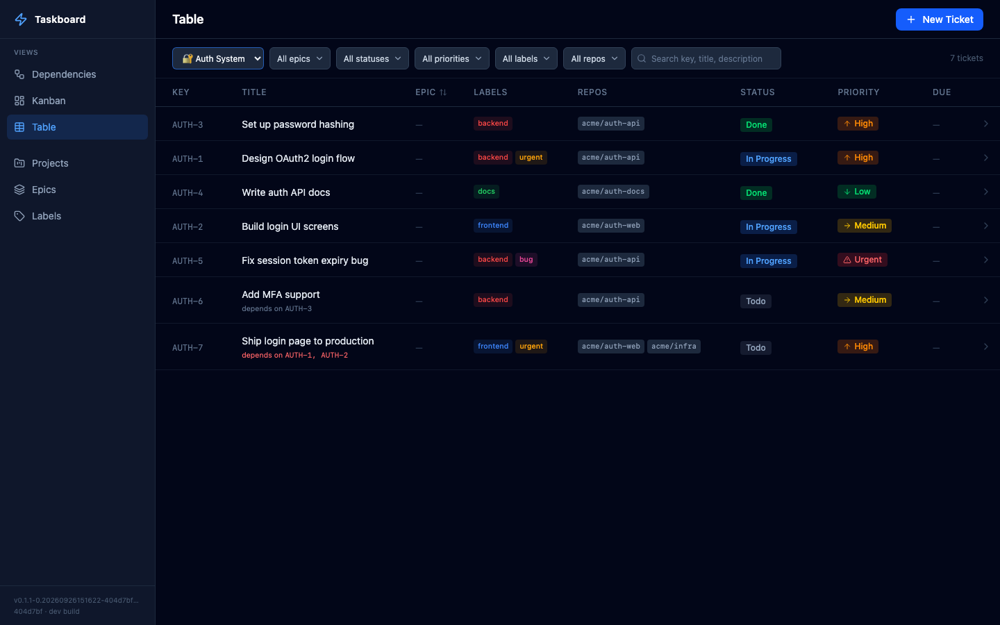

# Taskboard

A local, self-hosted project management tool with three views of your tickets (a dependency graph for a home page, a Kanban board and a table), a full CLI, and a built-in [MCP](https://modelcontextprotocol.io/) server that lets AI assistants manage your projects, tickets, and labels directly.

Single binary. SQLite-backed. No Docker, no external database, no runtime dependencies.

## Screenshots







## Features

- **Views** — the sidebar's Views group shows the same tickets three ways:
  - **Dependencies**, the home page at `/`, puts open tickets in columns by how many steps of unfinished work block them, with arrows from each blocker and cycles drawn in red. Hover a card to trace what blocks it and what it blocks; pan, zoom or fit the graph to the screen
  - **Kanban**, at `/kanban`, is drag-and-drop ticket management across Todo, In Progress, Agent Review, and Done columns
  - **Table**, at `/table`, lists tickets with their labels, repos, status, priority and due date
  - A filter bar shared by all three views narrows them by project, status, priority, label, repo and a text search over key, title and description. Filters live in the URL (for example `/kanban?project=ACP&status=todo&label=web`), so a filtered view can be bookmarked and switching views keeps them. Dependencies dims the tickets that don't match, keeping every arrow; Kanban and Table leave them out
- **Projects** — organize work with customizable projects (icons, colors, prefixes)
- **Tickets** — priority levels, due dates, labels, subtasks, dependencies, and one or more repos
- **CLI** — manage everything from the terminal
- **MCP Server** — 20 tools for AI-native project management via Model Context Protocol
- **Self-Hosted** — your data stays on your machine in a SQLite database
- **Single Binary** — one `brew install` and you're running

## Install

### Homebrew

```bash
brew install bilal-fazlani/tap/taskboard
```

Or tap first, then install by name:

```bash
brew tap bilal-fazlani/tap
brew trust bilal-fazlani/tap
brew install taskboard
```

Homebrew refuses to load a formula from a tap you haven't trusted, so run
`brew trust` after tapping. The one-line install above needs no extra step:
installing by the full name trusts that formula.

Upgrade to the latest release with:

```bash
brew upgrade taskboard
```

### From source

```bash
git clone https://github.com/bilal-fazlani/taskboard.git
cd taskboard
make build
```

Requires Go 1.24+ and Node.js 22+.

`make build`, `go build` and `go install` produce a development build: it never opens the default database, so every command needs `--db`, and `start` defaults to port 3011. The examples below, which rely on the default database and port 3010, assume a release binary or `make install`, which builds the marked binary, installs it to `~/.local/bin` and restarts the server.

## Usage

### Web UI

```bash
taskboard start
# => http://localhost:3010

taskboard start --port 8080
```

#### Linking to a ticket

Any view takes a `ticket` query parameter naming a ticket by display key (or by
id), and opens that ticket's editor on top of the page:

```
http://localhost:3010/?ticket=AUTH-1        # the Dependencies view
http://localhost:3010/kanban?ticket=AUTH-1  # the Kanban board
```

The editor's header shows the ticket's link with a button that copies it.
Opening a ticket adds the parameter to the view you are on and closing it
removes only that parameter, so the filters you had set stay put. Back closes
the editor, and unsaved edits are never dropped without asking — however the
close was asked for.

### API

`GET /api/version` says which build is serving, e.g. `{"version":"v0.2.0","commit":"1f3c9ab…","dev":false}`; `taskboard --version` prints the same, and the sidebar shows it at the bottom. Release binaries carry their tag, and Makefile builds (`make build`, `make dev`, `make install`) carry `git describe --tags --always --dirty`, both with the full commit. `dev` is true for every build but a release binary and the one `make install` builds.

`GET /api/events` streams database changes as [Server-Sent Events](https://developer.mozilla.org/en-US/docs/Web/API/Server-sent_events), so a client can refetch instead of polling:

```bash
curl -N http://localhost:3010/api/events
```

On connect the server sends a `: connected` comment. After that, commits to the database — from the web UI, the CLI, or the MCP server — produce a `changed` event (several commits close together may arrive as one):

```
event: changed
data: {}
```

A `: keep-alive` comment arrives roughly every 20 seconds while nothing changes, so proxies and browsers don't time the connection out. Comment lines (starting with `:`) carry no event and can be ignored. The stream does not replay changes made while a client was disconnected, so clients should refetch once when the connection (re)opens, in addition to refetching on each `changed` event.

`GET /api/tickets/{id}/history` returns a ticket's status changes, newest first. Every status change is recorded, whichever surface made it; the first entry, with an empty `fromStatus`, is the ticket's creation. `PUT /api/tickets/{id}` and `POST /api/tickets/{id}/move` take an optional `note`, saved with the change. Tickets carry `reviewRounds`, the number of times they have entered `agent_review`.

To add to a ticket's description without resending it, `PUT /api/tickets/{id}` takes `appendDescription` (MCP `update_ticket` takes the same argument, the CLI `ticket update --append-description`). The existing text is kept byte for byte; on a non-empty description the new text starts a new paragraph, with only the newlines needed for a blank line before it, and on an empty one it becomes the description. The append is read and written in one transaction, so appends at the same moment all land. It cannot be combined with `description`, and text that is empty or only whitespace is refused (a 400 over HTTP).

A ticket's `delivery` says where its work lives and where it landed: `branch`, `worktree`, `prUrl` and `landedCommits`, each commit a `sha` (7 to 64 hex characters, full or short, kept lowercase) with the `repo` it landed in, so one ticket can land in several repos. `PUT /api/tickets/{id}` takes `{"delivery": {...}}` (MCP `update_ticket` takes the same argument, the CLI `ticket update --branch`, `--worktree`, `--pr-url` and `--landed-commit repo@sha`). Only the fields given change: `""` clears a text field, and `landedCommits` replaces the whole list (`[]` clears it). A commit without a repo takes the ticket's repo when it has exactly one. The full ticket carries `delivery` when any field is set; lists leave it out. The web editor shows it, read only, in a Delivery section at the end of the fields column, which is hidden while nothing is set. MCP `find_tickets_by_commit` and the CLI `ticket find-by-commit` find the tickets that landed a commit, by its full or short sha.

Each project has a journal: dated entries, each with its author, that are appended and never edited or deleted (they go only with their project). It is the place for running notes and run reports, which would otherwise grow the description that every read carries. `POST /api/projects/{id}/journal` with `{"author": "...", "text": "..."}` appends one; `author` is free text, the name of whoever writes it. `GET /api/projects/{id}/journal` reads them newest first, one page at a time, as `{entries, total, hasMore, nextBefore}`: `?limit=` sets the page size (1 to 100, default 20) and `?before=` takes the previous page's `nextBefore` to read older entries. `GET /api/projects/{id}` carries the latest five as `journal`, in the same shape. The MCP tools are `append_project_journal` and `list_project_journal` (`get_project` carries the latest five too), and the CLI's are `project journal append` and `project journal list`.

`GET /api/tickets` filters by `projectId`, `status`, `priority`, `repo`, `label` and `epic`, plus `ready=true` (todo tickets whose dependencies are all done) and `excludeLabel` (leave out tickets with that label, e.g. `hold`). Repeat `status` for several, e.g. `?status=todo&status=in_progress`, or comma-separate them in one value, e.g. `?status=todo,in_progress`, the same as the CLI's `--status`. A status outside `todo`, `in_progress`, `agent_review` or `done` is a 400 naming the allowed values. Every filter given must match, so `ready=true` with statuses that leave out `todo` returns nothing. The CLI's `ticket list` and the MCP `list_tickets` tool take the same filters.

### CLI

```bash
taskboard project create "Auth System" --prefix AUTH --icon "🔐"
taskboard project create "Billing" --prefix BILL --description "Invoicing and payments." --agent-instructions "Run the tests before landing."
taskboard project list
taskboard project journal append BILL "Run finished: 3 tickets landed." --author orchestrator
taskboard project journal list BILL   # newest first; --limit and --before page through older entries

taskboard ticket create --project <ID> --title "Implement login" --priority high
taskboard ticket list --project <ID> --status todo
taskboard ticket get AUTH-1                          # labels, dependsOn and subtasks, as readable text
taskboard ticket get AUTH-1 --json                    # ...or as JSON
taskboard ticket move <ID> --status done --note "approved and landed"
taskboard ticket history AUTH-1   # status changes, newest first, with their notes

taskboard ticket subtask add AUTH-1 "Write the integration test"
taskboard ticket subtask toggle <subtask-id>          # flips it between done and not done
taskboard ticket subtask delete <subtask-id>

taskboard label create bug --color "#ef4444"
taskboard label list

taskboard ticket create --project <ID> --title "Implement login" --priority high \
  --label backend --repo acme/auth-api --repo acme/auth-web
taskboard ticket update <ID> --labels backend,urgent --depends-on AUTH-1
taskboard ticket update <ID> --repo acme/auth-api,acme/auth-web  # replaces the set
taskboard ticket update AUTH-1 --append-description "Worktree: ~/w/auth-1"  # adds a paragraph
taskboard ticket update AUTH-1 --branch auth-1-login --worktree ~/w/auth-1 \
  --landed-commit acme/auth-api@6bafa19,acme/auth-web@a198cc5          # where it lives and landed
taskboard ticket find-by-commit 6bafa19                          # which ticket landed this commit
taskboard ticket list --repo acme/auth-api                       # tickets touching that repo
taskboard ticket list --project AUTH --status todo,in_progress   # any of several statuses (or repeat --status)
taskboard ticket list --project AUTH --ready --exclude-label hold # todo tickets whose dependencies are all done, minus held ones
taskboard ticket list --project AUTH --summary                    # one short line per ticket, 50 to a page
taskboard ticket list --project AUTH --summary --offset 50        # the next page
```

`ticket list --summary` prints one short line per ticket, for picking
tickets: key, title, status, priority, epic, labels, the tickets it depends
on with their status, subtask progress and link. With `--summary`, `--limit`
(1 to 200, default 50) or `--offset` the list comes a page at a time and ends
with a line such as `Showing 1-50 of 120 tickets. Next page: --offset 50`.
Without them it prints every match in full, as before.

`ticket get`, `ticket move`, `ticket history`, `ticket delete`, `ticket update`
and `ticket subtask add` all accept either a ticket's ID or its display key
(e.g. `AUTH-1`); the display key matches case-insensitively, the ID does not.
`ticket subtask toggle` and `ticket subtask delete` address the subtask itself
by ID, since subtasks have no display key of their own.

`ticket move` and `ticket update` take an optional `--note`, saved in the
ticket's status history when the status changes. The CLI never requires one.

`ticket list`, `ticket create` and `ticket update` print each ticket's link
alongside it, so an agent working through the CLI can hand a person a URL
rather than a bare key.

The link points at `http://localhost:<default port>` — 3010 for an installed
build, 3011 for a development one. The CLI and the MCP server read the database
directly rather than through a running server, so they cannot tell that
`taskboard start --port 8080` moved the board; set `TASKBOARD_URL` to say where
it is:

```bash
TASKBOARD_URL=http://localhost:8080 taskboard ticket list
TASKBOARD_URL=https://board.example.com taskboard mcp
```

### MCP Server (for AI assistants)

```bash
taskboard mcp
```

#### Claude Code

```bash
claude mcp add taskboard -- /path/to/taskboard mcp
```

#### Claude Desktop

Add to `~/.claude/claude_desktop_config.json`:

```json
{
  "mcpServers": {
    "taskboard": {
      "command": "/path/to/taskboard",
      "args": ["mcp"]
    }
  }
}
```

#### Data Hierarchy

```
Project → Ticket → Subtask
(initiative)  (task)    (step)
```

- **Projects** are the top-level grouping (like epics/initiatives). Create one per body of work.
- **Tickets** are concrete, actionable tasks within a project. Don't create "epic" tickets — use projects.
- **Subtasks** are checklist steps within a ticket, for breaking work into verifiable pieces.

#### Dependencies

A ticket can declare that it depends on other tickets, by ID or by display key
such as `AUTH-1`. Dependencies may cross projects. They are informational: a
ticket whose dependencies are unfinished can still be moved to any status.

The reverse direction is derived, not stored. When `BILL-5` depends on `BILL-2`,
`BILL-2` lists `BILL-5` under *blocks* automatically, and that list is read-only.

#### Available MCP Tools (23)

| Tool                     | Description                                      |
| ------------------------ | ------------------------------------------------ |
| **Projects**             |                                                  |
| `list_projects`          | List all projects with optional status filter    |
| `get_project`            | Get project details, with its agent instructions |
| `create_project`         | Create a new project (use for epics/initiatives) |
| `update_project`         | Update project properties                        |
| `delete_project`         | Delete a project and all its tickets             |
| `append_project_journal` | Append a dated entry to a project's journal      |
| `list_project_journal`   | Read a project's journal, newest first, by page  |
| **Labels**               |                                                  |
| `list_labels`            | List all labels with ticket counts               |
| `create_label`           | Create a label with a name and color             |
| `update_label`           | Rename or recolor a label, by id or exact name   |
| `delete_label`           | Delete a label and report tickets detached       |
| **Tickets**              |                                                  |
| `list_tickets`           | List tickets with filters                        |
| `get_ticket`             | Get ticket details, subtasks, labels and history |
| `create_ticket`          | Create a ticket (task) within a project          |
| `update_ticket`          | Update ticket properties, with an optional note  |
| `move_ticket`            | Move ticket to a status column, with a note      |
| `delete_ticket`          | Delete a ticket                                  |
| `find_tickets_by_commit` | Find the tickets that landed a commit, by sha    |
| **Board**                |                                                  |
| `get_board`              | Get full Kanban board grouped by status          |
| **Subtasks**             |                                                  |
| `create_subtask`         | Add a subtask to a ticket                        |
| `batch_create_subtasks`  | Add multiple subtasks to a ticket at once        |
| `toggle_subtask`         | Set subtask completion (or toggle it)            |
| `delete_subtask`         | Remove a subtask from a ticket                   |

#### Status notes

`move_ticket` and `update_ticket` take a `note`, saved with the status change
in the ticket's history, which `get_ticket` returns. Over MCP a note is
required when a ticket leaves `agent_review`: say why, either that it was
approved and landed, or the findings it was sent back for. The web UI, HTTP
API and CLI accept a note but never require one.

#### Ticket summaries and paging

`list_tickets` takes `summary: true` to return each ticket as its `key`,
`title`, `status`, `priority`, `epic`, `labels`, `dependsOn` (each with its
`key` and `status`), `subtasks` progress (`"2/5"`) and `url`: enough to pick
tickets, a small fraction of the full form. `limit` (1 to 200, default 50) and
`offset` page through long lists. With `summary`, `limit` or `offset` the
answer is one page, `{tickets, total, offset, limit, hasMore, nextOffset}`;
call again with `offset` set to `nextOffset` for the next. Without them it is
the array of every match in full, as before. `GET /api/tickets` does not page.

`list_tickets`, `get_ticket`, `create_ticket` and `update_ticket` add a `url`
field to each ticket — the link that opens it in the web UI — so an assistant
can cite a ticket rather than just name it. It follows `TASKBOARD_URL` the same
way the CLI does.

#### Change confirmations

Every MCP tool that creates or changes something (`create_*`, `update_*`,
`move_ticket` and the subtask tools) answers with a short confirmation by
default: the record's id and name (a ticket's key, title and status), what the
call did (`created: true`, or `changed`: the fields it changed, `[]` when it
changed nothing), `updatedAt` and the `url`, where the record has them. Pass
`full: true` for the whole record instead; the subtask tools then return their
whole ticket. The HTTP API, CLI and web UI are unchanged.

#### Example Prompts

Once the MCP is connected, you can talk to your AI assistant in high-level terms and let it figure out the breakdown:

```
I'm building a SaaS billing system. Set up the project and break the work
into tickets covering Stripe integration, usage metering, invoice generation,
and a customer billing portal. Prioritize accordingly.
```

```
I need to ship a password reset flow. Think through what's involved — API
endpoints, email templates, token handling, UI screens, tests — and create
tickets with subtasks for each piece.
```

```
Look at my board and figure out what's blocking progress. If anything in
"in progress" has been sitting there without subtasks, break it down into
concrete next steps.
```

Here's what that looks like — a project and tickets created entirely by an AI assistant via MCP:





The agent shares the same SQLite database via MCP, so tickets it creates show up on your board immediately.

## Data Storage

All data is stored in a SQLite database at:

- **macOS**: `~/Library/Application Support/taskboard/taskboard.db`
- **Linux**: `~/.config/taskboard/taskboard.db`

Only release binaries and `make install` use this default. A development build (`make build`, `go build`, `go install`) exits with an error unless you pass `--db`.

Migrations run automatically on first start.

### Custom Database Path

Use `--db` to point any command at a different database file:

```bash
taskboard --db /path/to/other.db start
taskboard --db /path/to/other.db mcp
taskboard --db /path/to/other.db ticket list
```

### Clearing Data

To wipe all projects, tickets, and labels while keeping the schema intact:

```bash
taskboard clear        # prompts for confirmation
taskboard clear -f     # skip confirmation
```

This also respects `--db`, so you can clear a specific database file:

```bash
taskboard --db /tmp/test.db clear -f
```

## Tech Stack

| Layer        | Technology                                          |
| ------------ | --------------------------------------------------- |
| Language     | Go                                                  |
| Database     | SQLite (via modernc.org/sqlite, pure Go)            |
| CLI          | cobra                                               |
| HTTP         | chi                                                 |
| Frontend     | React, TypeScript, Tailwind CSS v4, dnd-kit         |
| MCP          | JSON-RPC over stdio                                 |
| Distribution | Single binary with embedded frontend via `embed.FS` |

## Development

```bash
# Run backend on :3011 against a throwaway database at ./.tmp/dev.db
# (never the live board on :3010). Override with DEV_PORT=... / DEV_DB=...
make dev

# Run frontend dev server (proxies API to the make dev backend)
make dev-frontend

# Build everything
make build

# Clean
make clean
```

`make dev-frontend` proxies `/api`, including `/api/events`, straight through to the `make dev` backend with no buffering, so the SSE stream above works the same as it does from the built binary.

`/api/events` is backed by a watcher (`internal/db/watch.go`) that polls `PRAGMA data_version` on its own dedicated SQLite connection, roughly every 250ms. `data_version` changes whenever any other connection commits; since the watcher's dedicated connection never writes, this one poll catches every write: from the server's own store, which uses separate connections, and from the CLI and MCP server, which run as separate processes. No SQLite hooks or triggers are needed. If the watcher's connection drops, it reconnects with backoff (capped at 5s) and fires one more change notification on reconnect, since a commit made during the gap can't be told apart from the new connection's baseline.

## Contributing

See [CONTRIBUTING.md](CONTRIBUTING.md) for guidelines.

## License

[MIT](LICENSE)
