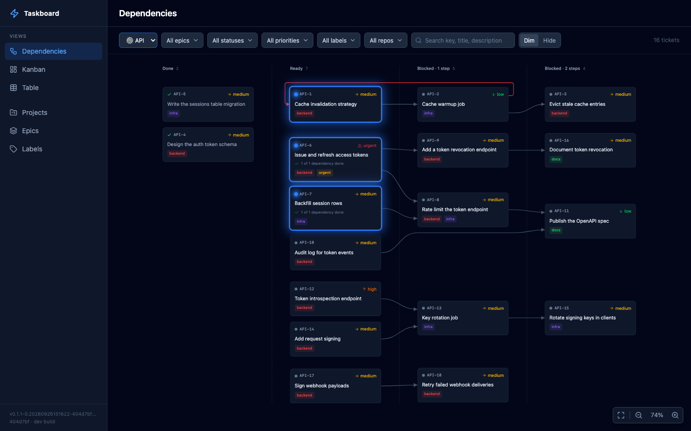
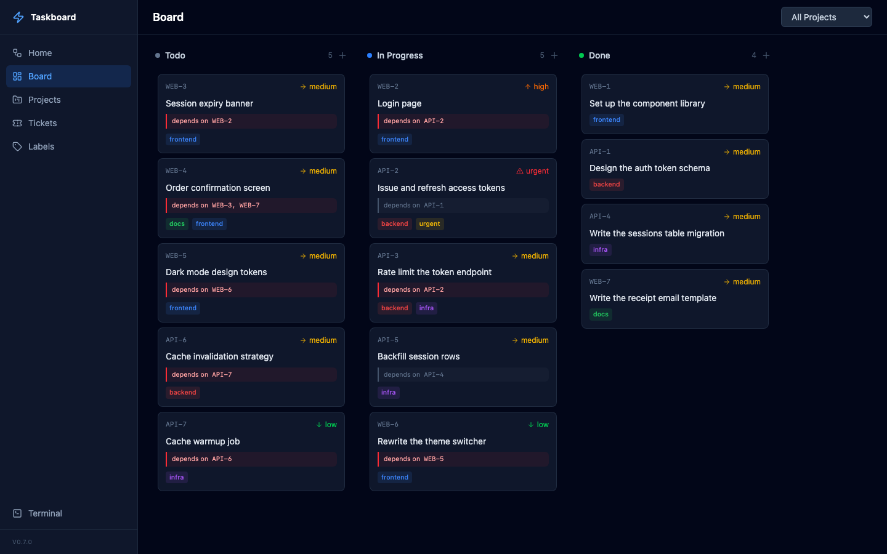
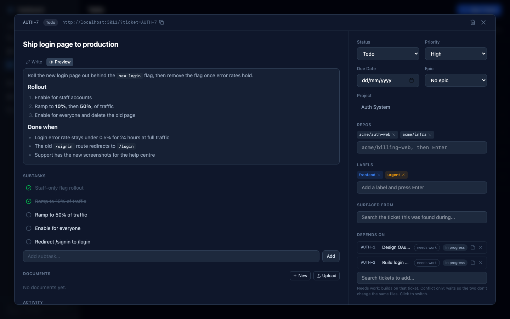
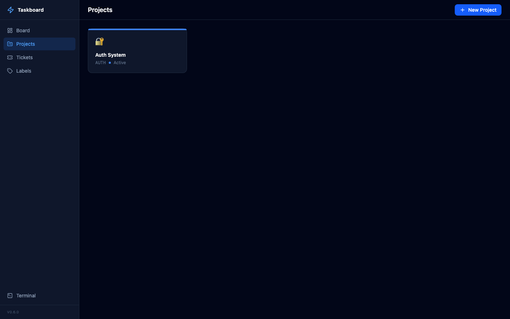
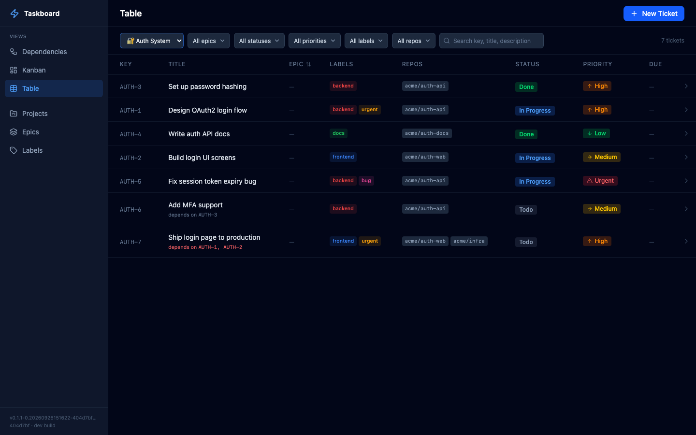

# Taskboard

A local, self-hosted project management tool with a home page of what is moving now, three views of your tickets (a dependency graph, a Kanban board and a table), a full CLI, and a built-in [MCP](https://modelcontextprotocol.io/) server that lets AI assistants manage your projects, tickets, and labels directly.

Single binary. SQLite-backed. No Docker, no external database, no runtime dependencies.

## Screenshots







## Features

- **Now**, the home page at `/now` (`/` goes there) and the sidebar's top entry, shows what is moving across every project (or one, from its dropdown): first the tickets waiting on you, oldest first, each with its request's type and prompt, then each ticket in progress or in review with its subtask progress, review round and how long it has been in its status, with a review told apart as still running or approved and waiting on you, and below them the tickets that landed in the last 24 hours (at most 10) with their commits. It updates live, and each ticket opens its editor
- **Views** — the sidebar's Views group shows the same tickets three ways:
  - **Dependencies**, at `/dependencies`, puts open tickets in columns by how many steps of unfinished work block them, with arrows from each blocker; the edge that closes a cycle is drawn in red. Hover a card to trace what blocks it and what it blocks; pan, zoom or fit the graph to the screen
  - **Kanban**, at `/kanban`, is drag-and-drop ticket management across Todo, In Progress, Agent Review, and Done columns
  - **Table**, at `/table`, lists tickets with their labels, repos, status, priority and due date
  - A filter bar shared by all three views narrows them by project, status, priority, label, repo and a text search over key, title and description. Filters live in the URL (for example `/kanban?project=ACP&status=todo&label=web`), so a filtered view can be bookmarked and switching views keeps them. Dependencies dims the tickets that don't match, keeping every arrow; Kanban and Table leave them out
- **Projects** — organize work with customizable projects (icons, colors, prefixes)
- **Tickets** — priority levels, due dates, labels, subtasks, dependencies, and one or more repos
- **CLI** — manage everything from the terminal
- **MCP Server** — 20 tools for AI-native project management via Model Context Protocol
- **Self-Hosted** — your data stays on your machine in a SQLite database
- **Single Binary** — one `brew install` and you're running

## Install

### Homebrew

```bash
brew install bilal-fazlani/tap/taskboard
```

Or tap first, then install by name:

```bash
brew tap bilal-fazlani/tap
brew trust bilal-fazlani/tap
brew install taskboard
```

Homebrew refuses to load a formula from a tap you haven't trusted, so run
`brew trust` after tapping. The one-line install above needs no extra step:
installing by the full name trusts that formula.

Upgrade to the latest release with:

```bash
brew upgrade taskboard
```

### From source

```bash
git clone https://github.com/bilal-fazlani/taskboard.git
cd taskboard
make build
```

Requires Go 1.24+ and Node.js 22+.

`make build`, `go build` and `go install` produce a development build: it never opens the default database, so every command needs `--db`, and `start` defaults to port 3011. The examples below, which rely on the default database and port 3010, assume a release binary or `make install`, which builds the marked binary, installs it to `~/.local/bin` and restarts the server.

`make build` embeds the web UI: it builds the web app and compiles with `-tags frontend`, which fails if the web build is missing. A plain `go build` or `go install` leaves the web UI out and says so, on start and in the browser; the API, CLI and MCP server work the same.

## Usage

### Web UI

```bash
taskboard start
# => http://localhost:3010

taskboard start --port 8080
```

#### Linking to a ticket

Any view takes a `ticket` query parameter naming a ticket by display key (or by
id), and opens that ticket's editor on top of the page:

```
http://localhost:3010/?ticket=AUTH-1              # the view you used last
http://localhost:3010/kanban?ticket=AUTH-1        # the Kanban board
http://localhost:3010/dependencies?ticket=AUTH-1  # the Dependencies view
```

`/?ticket=…` is a ticket's canonical link, the one the CLI and the MCP server
hand out: it goes on to whichever of Dependencies, Kanban and Table you used
last (Kanban if none), keeping every other parameter. The editor's header
shows the ticket's link with a button that copies it.
Opening a ticket adds the parameter to the view you are on and closing it
removes only that parameter, so the filters you had set stay put. Back closes
the editor, and unsaved edits are never dropped without asking — however the
close was asked for.

#### Answering an agent

A ticket's page answers an agent's request for user input in one step. An open
request comes first on the page, in red, with the form its type calls for: a
question offers its choices and a box to answer in your own words instead (what
you write wins over a picked choice, and one of the two is needed), and an
approval offers Approve and Decline with one optional note that goes with
either. Once sent, the ticket is back in progress and a toast names the agent
that collects the answer; a request answered or closed elsewhere first is
dropped from the page, saying so. Earlier requests sit in a fold under the open
one, or at the top of the page when none is open, newest first, each with its
answer, note, who answered and when. Only `approved` reads as approved and only
`declined` as declined; a request closed any other way, such as by stopping
work, reads as closed.

### API

`GET /api/version` says which build is serving, e.g. `{"version":"v0.2.0","commit":"1f3c9ab…","dev":false}`; `taskboard --version` prints the same, and the sidebar shows it at the bottom. Release binaries carry their tag, and Makefile builds (`make build`, `make dev`, `make install`) carry `git describe --tags --always --dirty`, both with the full commit. `dev` is true for every build but a release binary and the one `make install` builds.

`GET /api/events` streams database changes as [Server-Sent Events](https://developer.mozilla.org/en-US/docs/Web/API/Server-sent_events), so a client can refetch instead of polling:

```bash
curl -N http://localhost:3010/api/events
```

On connect the server sends a `: connected` comment. After that, commits to the database — from the web UI, the CLI, or the MCP server — produce a `changed` event (several commits close together may arrive as one):

```
event: changed
data: {}
```

A `: keep-alive` comment arrives roughly every 20 seconds while nothing changes, so proxies and browsers don't time the connection out. Comment lines (starting with `:`) carry no event and can be ignored. The stream does not replay changes made while a client was disconnected, so clients should refetch once when the connection (re)opens, in addition to refetching on each `changed` event.

`GET /api/tickets/{id}/history` returns a ticket's status changes, newest first. Every status change is recorded, whichever surface made it; the first entry, with an empty `fromStatus`, is the ticket's creation. `PUT /api/tickets/{id}` and `POST /api/tickets/{id}/move` take an optional `note`, saved with the change. Tickets carry `reviewRounds`, the number of times they have entered `agent_review`. Done tickets in ticket lists (`GET /api/tickets`, MCP `list_tickets` in its full form) and on the board (MCP `get_board`) carry `doneAt`, the time the ticket last moved to done, or its `createdAt` when no move to done is logged because it was done before the status history began; it is left out for tickets that are not done, and on the full ticket.

`GET /api/projects/{id}/activity` returns the status changes of a whole project, ticket creation included, newest first, as `{entries, hasMore, nextBefore}`; each entry is a status change plus its ticket's `ticketKey`, `ticketTitle` and `epic`. `?epic=` narrows it to tickets in an epic (a name, an id, or `none`; repeat it for several), `?limit=` sets the page size (1 to 200, default 50) and `?before=` takes the previous page's `nextBefore`. The web UI's Activity view shows it, updating live.

To add to a ticket's description without resending it, `PUT /api/tickets/{id}` takes `appendDescription` (MCP `update_ticket` takes the same argument, the CLI `ticket update --append-description`). The existing text is kept byte for byte; on a non-empty description the new text starts a new paragraph, with only the newlines needed for a blank line before it, and on an empty one it becomes the description. The append is read and written in one transaction, so appends at the same moment all land. It cannot be combined with `description`, and text that is empty or only whitespace is refused (a 400 over HTTP).

A ticket's `delivery` says where its work lives and where it landed: `branch`, `worktree`, `prUrl` and `landedCommits`, each commit a `sha` (7 to 64 hex characters, full or short, kept lowercase) with the `repo` it landed in, so one ticket can land in several repos. `PUT /api/tickets/{id}` takes `{"delivery": {...}}` (MCP `update_ticket` takes the same argument, the CLI `ticket update --branch`, `--worktree`, `--pr-url` and `--landed-commit repo@sha`). Only the fields given change: `""` clears a text field, and `landedCommits` replaces the whole list (`[]` clears it). A commit without a repo takes the ticket's repo when it has exactly one. The full ticket carries `delivery` when any field is set; lists leave it out. The web editor shows it, read only, in a Delivery section at the end of the fields column, which is hidden while nothing is set. MCP `find_tickets_by_commit` and the CLI `ticket find-by-commit` find the tickets that landed a commit, by its full or short sha.

`GET /api/now` answers the Now page in one request, as `{inProgress, waiting, inReview, landed}`. The first three hold every ticket in `in_progress`, `needs_user_input` (waiting on the person) or `agent_review`, longest in its status first, each with its `key`, `title`, `projectPrefix`, `subtasksDone`, `subtasksTotal`, `reviewRounds` and `since` (when it last entered its status); a waiting ticket also carries `request`, its open request as `{type, prompt, createdAt}`, and a ticket in review carries `review`: `approved` or `changes` when its latest `Review <round>` document, saved since it last entered review, starts with `VERDICT: APPROVE` or `VERDICT: CHANGES`, and `running` otherwise. A ticket in progress or waiting that no live agent works (it has no holder, or its holder's session is stale) carries `unattended: true`. A ticket in progress whose newest request is answered, whoever holds it, carries `answered`: that request as `{type, prompt, answer, note, answeredBy, answeredAt}` (`stopped: true` instead of an answer when the person stopped the work); waiting tickets and tickets in review never carry it. `request` is HTTP only: MCP `get_now` leaves it out to stay compact, and carries `answered` as `{type, prompt, answer, note}`. `landed` holds the tickets that moved to done in the last 24 hours, newest first, at most 10, each with its `doneAt` and landed `commits`. `?projectId=` (an id or prefix) narrows every group to one project.

Deleting a project (`DELETE /api/projects/{id}`, MCP `delete_project`, CLI `project delete`) archives it: the project and its tickets, epics, documents and entries disappear from every read and every tool, a write to any of them is not found, and links into it (`dependsOn`, `blocks`, `surfacedFrom`, `surfaced`) are left out and no longer hold a ticket back from `ready`. Nothing is removed from the database and nothing restores it. Its prefix stays taken, so an old key never names a different ticket. A project's `status` is always `active`: `PUT /api/projects/{id}` (MCP `update_project`) refuses any other with a 400, and `GET /api/projects` (MCP `list_projects`) has no status filter.

Entries are short typed records of why the work is as it is, on a project, an epic or a ticket: `decision` (with its `source`, `agent` or `person`), `learning`, `note` (the person's instruction, open until an agent marks it handled; `about` points it at an entry to challenge it), and on a ticket only `hand_off`, `proof` and `review` (with `verdict`, `findings` by severity and `reportDocument`). Each names its author: an agent (`agentId`) or the person (`authorName`). Entries are never edited: a new entry of the same type names the one it `replaces`, which is kept but left out of reads. `POST /api/projects/{id}/entries`, `/api/epics/{id}/entries` or `/api/tickets/{id}/entries` writes one (a project by id or prefix, a ticket by id or key; a note sent with no author is the server's user's), and `GET` on the same route reads them newest first as `{entries, total, hasMore, nextBefore, agents}`: current ones only unless `?includeReplaced=true`, `?type=` for some types (repeat or comma-separate), `?limit=` (1 to 100, default 20) and `?before=` for older pages. `agents` holds each agent the page's entries name (as author, or as the agent that handled a note) by id, with its role, model, provider and `session` (its resume command and machine); it is left out when they name none. `POST /api/entries/{id}/handled` with `{"agentId": "..."}` marks a note handled. `GET /api/tickets/{id}` carries a page of the ticket's 20 newest current entries as `entries`, `openNotes`, and `epicOpenNotes` and `projectOpenNotes`, counted but not read; each is left out when there are none. The MCP tools are `write_entry`, `list_entries` and `handle_note`, and the CLI's are `entry add`, `entry list` and `entry handle`. The web ticket editor shows a ticket's entries grouped by type, in reading order (open notes, where it stands, decisions, reviews, learnings, proof, then subtasks, documents and the status history), each replaced entry folded under the one that replaced it; each names its type and author (role, model and a mark for the model's provider, or "You"), with a chip that copies the session's resume command and shows its machine on hover. You leave a note in the box under Notes, or challenge a decision, learning or proof with its Challenge action, which starts a note pointing at it. The side column counts the epic's and project's entries, and all of it updates live. Its links open the epic's dialog on the Epics page, or the project's dialog on the Projects page (`/projects?project=ACP` opens a project's dialog by prefix or id), scrolled to their entries: open notes with the same note box, then decisions and learnings, the 3 newest of each type with "Show N older" for the rest.

`GET /api/tickets` filters by `projectId`, `status`, `priority`, `repo`, `label` and `epic`, plus `ready=true` (todo tickets whose dependencies are all done) and `excludeLabel` (leave out tickets with that label, e.g. `hold`). Repeat `status` for several, e.g. `?status=todo&status=in_progress`, or comma-separate them in one value, e.g. `?status=todo,in_progress`, the same as the CLI's `--status`. A status outside `todo`, `in_progress`, `agent_review` or `done` is a 400 naming the allowed values. Every filter given must match, so `ready=true` with statuses that leave out `todo` returns nothing. The CLI's `ticket list` and the MCP `list_tickets` tool take the same filters.

`POST /api/agents` identifies a session and a new agent within it: `vendor` and `vendorSessionId` name the session (found again by that pair, or created with `machine`, `resumeCommand` and `webUrl`), and `role`, `model` and `provider` (one of `anthropic`, `openai`, `google`, `other`) name the agent; identifying always creates a new agent, never an upsert by name, since agents have none. It answers with the new agent. `GET /api/agents` lists every agent, most recently seen first, each with its `session`, `stale` (worked out from the install's stale threshold, not stored) and `heldTickets` (the tickets it holds now, by key, title and status); `GET /api/agents/{id}` answers one, the same shape. There is no claim route: the one-call start claims. `POST /api/tickets/{id}/release` gives a ticket back, with `{"agentId":"...","outcome":"give_back","handOff":"..."}`, or finishes it, with `"outcome":"finish"` and `proof` instead of `handOff`; a release missing its hand-off or proof, mixing the two, or from an agent outside the holder's session, is refused, naming what is wrong.

`POST /api/tickets/{id}/start` with `{"agentId":"..."}` is how an agent begins a ticket, in one call: it claims the ticket and answers everything needed to begin. That is `ticket` and `project`. The `ticket` is lean: without `agent` (the caller), its `subtasks` carry only `id`, `title` and `completed`, its `labels` only `name` and `color`, and its linked tickets (`dependsOn`, `blocks`, `surfacedFrom`, `surfaced`) `key`, `title`, `status` and, on a dependency, `kind` and `note`, with no ids; it carries `answeredRequests`: its answered requests for user input, newest first, `type`, `prompt`, `answer`, `note`, `answeredBy` and `answeredAt` — a request the person closed by stopping work instead of answering it carries `stopped: true` and no `answer`; left out when the ticket has none. The `project` is `name`, `description`, `agentInstructions`, and `entries`: its 5 newest current entries other than open notes, with `total`, `hasMore` and `nextBefore` for the rest (`total` leaves out the open notes, which `list_entries` counts). `agentInstructions` come on each agent's first start in the project, and again once they change; an agent that already has them gets `agentInstructionsLeftOut` instead, saying so and that MCP `get_project` (or `GET /api/projects/{id}`) reads them again. Per agent, not per session: an orchestrator's implementers and reviewers share its session, and each gets them on its own first start. Plus, each only when there is one: `takenFrom`, `stopped` (`by` and `at`: the person's stop on the caller's session's work, which this start lifts), `handOff` (the latest hand-off), `entries` (the ticket's other current entries, all of them), `notes` (the person's open notes on the ticket, epic and project), `epic` (`description`, `documents` by name, `entries`) and `unfinishedDependencies` (keys; they never block a start). No entry names its owner, open notes appear only under `notes`, and each entry an agent wrote names that agent's `agentRole` and `agentModel` beside its `agentId`. A ticket an agent of another session holds is refused while that session is live, naming the holder and when its session was last seen; once it is stale, the start takes the ticket over and `takenFrom` names the agent it came from. A done ticket is refused too, naming it and how to reopen it on purpose: move it to `todo`, then start it; the ticket stays done with no holder. What a start costs is mostly its text. On a ticket shaped like this project's own (3.9 KB of agent instructions, a 2 KB description, ten project entries of about 400 bytes, six subtasks, two dependencies, an answered request and two ticket entries), every start was 17.2 KB, some 4.3k tokens; lean, an agent's first start is 14.6 KB, some 3.6k tokens (2.7 KB, 15%, less: the ticket part went from 5.4 to 4.9 KB and the project's entries from 5.5 to 3.1 KB, offset by 0.2 KB for naming each entry's author) and each later start of the same agent 10.8 KB, some 2.7k tokens (6.4 KB, 37%, less: the 3.9 KB of agent instructions become a 120-byte pointer). `TestStartTicketRealisticSize` measures it; another test holds the start's structure, every part with one sentence of text, under 5.3 KB.

The person stops work with `POST /api/tickets/{id}/stop` (no body; CLI `ticket stop`, and Stop work on the ticket page; no MCP tool, since agents give work back with release). It frees the ticket at once, whether its agent is live or stale: the agent is cleared, the ticket returns to `todo`, a request it waits on is closed unanswered, and its status history names the local person who stopped it and the agent that held it. The agent is not asked: its session's next write on the ticket (an entry, a request, finishing, handling a note) is refused with "stopped by the person", except its hand-off (a release with `give_back`, or a `hand_off` entry), which is still accepted and changes nothing else. Starting the ticket again lifts the stop for that session, and the start's `stopped` says who stopped it and when.

An agent asks the person for user input with `POST /api/tickets/{id}/requests`: `type` (`approval` or `question` today), `prompt`, and optional `choices`. It moves the ticket to `needs_user_input` and answers with the new request; a ticket already waiting on an unanswered request, or held by no agent, refuses a second. While the request is open the ticket stays in `needs_user_input`: a status change out of it through `POST /api/tickets/{id}/move` or `PUT /api/tickets/{id}` is a 409 naming the request, and writes nothing (the CLI's `ticket move` and `ticket update --status`, and MCP `move_ticket` and `update_ticket`, are refused the same way). Only the person takes it out, by answering the request or by stopping the work. `GET /api/tickets/{id}/requests` reads a ticket's whole history, newest first, answered and unanswered alike. `POST /api/requests/{id}/answer` takes `answer`, `answeredBy` and an optional `note`. For a `question`, `answer` may be any non-empty text; when it matches one of the request's `choices`, case-insensitively, it is stored as the choice is written. For an `approval`, `answer` is always `approved` or `declined`, matched case-insensitively and stored that way, whatever `choices` the request offered — they suggest nothing there and change nothing. One request of either type closes without the person's answer: when the person stops work on its ticket, its `answer` is "Not answered: the person stopped work on this ticket." (neither approved nor declined), meaning the ticket is no longer the asking agent's, and it carries `stopped: true` besides, set the same way at read time (`answer` equal to that sentence) so a caller reads the flag rather than pattern-matching the sentence itself. `answeredBy` left out or blank defaults to the local person (the OS user), since an answer is today always the local person's; `note` is optional either way and is returned on every read of the request, alongside `answer`. `GET /api/requests/{id}/await?timeout=30s` long-polls that one request only, never whatever else is open on its ticket: the timeout defaults to 30s and is capped at 60s, and its own passing is never an error — the request comes back unanswered, with a 200, rather than as a timeout error. Ticket JSON gains `agent` (the agent holding it, if any) and `openRequest` (the request it waits on, if any).

Across the agent and request routes, an unresolved ticket or request id is a 404, a request these routes refuse (bad input, a missing hand-off or proof, an unknown type, a second open request) is a 400, and a ticket held by another session (a start while it is live, or a release from outside the holder's session), or an agent's write on work the person stopped, is a 409 — each with the store's own message.

### CLI

```bash
taskboard project create "Auth System" --prefix AUTH --icon "🔐"
taskboard project create "Billing" --prefix BILL --description "Invoicing and payments." --agent-instructions "Run the tests before landing."
taskboard project list

taskboard entry add --ticket AUTH-1 --type learning --agent <agent-id> "The test DB needs foreign keys on."
taskboard entry add --epic Login --project AUTH --type decision --source person "Sessions over JWTs: revocation matters."
taskboard entry add --project AUTH --type note "Keep the login page free of tracking."   # yours, as your user name (or --author)
taskboard entry add --ticket AUTH-1 --type learning --agent <agent-id> --replaces <entry-id> "..."  # corrects an entry
taskboard entry list --ticket AUTH-1                  # current entries, newest first; --type, --all, --limit, --before
taskboard entry handle <note-id> --agent <agent-id>   # the agent acted on the note

taskboard ticket create --project <ID> --title "Implement login" --priority high
taskboard ticket list --project <ID> --status todo
taskboard ticket get AUTH-1                          # labels, dependsOn and subtasks, as readable text
taskboard ticket get AUTH-1 --json                    # ...or as JSON
taskboard ticket move <ID> --status done --note "approved and landed"
taskboard ticket history AUTH-1   # status changes, newest first, with their notes

taskboard ticket subtask add AUTH-1 "Write the integration test"
taskboard ticket subtask toggle <subtask-id>          # flips it between done and not done
taskboard ticket subtask delete <subtask-id>

taskboard label create bug --color "#ef4444"
taskboard label list

taskboard ticket create --project <ID> --title "Implement login" --priority high \
  --label backend --repo acme/auth-api --repo acme/auth-web
taskboard ticket update <ID> --labels backend,urgent --depends-on AUTH-1
taskboard ticket update AUTH-3 --depends-on AUTH-1,AUTH-2:conflict_only \
  --depends-on-note "AUTH-2=internal/auth/session.go, web/src/Login.tsx"   # AUTH-2 only to avoid a conflict in those files
taskboard ticket create --project AUTH --title "Found on the way" --surfaced-from AUTH-3
taskboard ticket update <ID> --repo acme/auth-api,acme/auth-web  # replaces the set
taskboard ticket update AUTH-1 --append-description "Worktree: ~/w/auth-1"  # adds a paragraph
taskboard ticket update AUTH-1 --branch auth-1-login --worktree ~/w/auth-1 \
  --landed-commit acme/auth-api@6bafa19,acme/auth-web@a198cc5          # where it lives and landed
taskboard ticket find-by-commit 6bafa19                          # which ticket landed this commit
taskboard ticket list --repo acme/auth-api                       # tickets touching that repo
taskboard ticket list --project AUTH --status todo,in_progress   # any of several statuses (or repeat --status)
taskboard ticket list --project AUTH --ready --exclude-label hold # todo tickets whose dependencies are all done, minus held ones
taskboard ticket list --project AUTH --summary                    # one short line per ticket, 50 to a page
taskboard ticket list --project AUTH --summary --offset 50        # the next page
```

`ticket list --summary` prints one short line per ticket, for picking
tickets: key, title, status, priority, epic, labels, the tickets it depends
on with their status, subtask progress and link. With `--summary`, `--limit`
(1 to 200, default 50) or `--offset` the list comes a page at a time and ends
with a line such as `Showing 1-50 of 120 tickets. Next page: --offset 50`.
Without them it prints every match in full, as before.

`ticket get`, `ticket move`, `ticket history`, `ticket delete`, `ticket update`
and `ticket subtask add` all accept either a ticket's ID or its display key
(e.g. `AUTH-1`); the display key matches case-insensitively, the ID does not.
`ticket subtask toggle` and `ticket subtask delete` address the subtask itself
by ID, since subtasks have no display key of their own.

`ticket move` and `ticket update` take an optional `--note`, saved in the
ticket's status history when the status changes. The CLI never requires one.
Neither takes a ticket out of `needs_user_input` while its request is open:
the person answers it (`request answer`, or on the ticket page) or stops the
work (`ticket stop`).

`ticket list`, `ticket create` and `ticket update` print each ticket's link
alongside it, so an agent working through the CLI can hand a person a URL
rather than a bare key.

The link points at `http://localhost:<default port>` — 3010 for an installed
build, 3011 for a development one. The CLI and the MCP server read the database
directly rather than through a running server, so they cannot tell that
`taskboard start --port 8080` moved the board; set `TASKBOARD_URL` to say where
it is:

```bash
TASKBOARD_URL=http://localhost:8080 taskboard ticket list
TASKBOARD_URL=https://board.example.com taskboard mcp
```

#### Agent protocol

The CLI equivalents of the agent protocol: identify as an agent, ask for and
answer user input, and give a ticket back or finish it. There is no claim
command — claiming a ticket is part of the one-call start. Every command
below also takes `--json`, printing its result as JSON instead of readable
text.

```bash
# Identify a new agent in a session (found by --vendor and --session-id, or
# created); an agent has no name of its own, so every call makes a new one.
# Print the agent id and pass it as --agent below.
taskboard agent identify --vendor claude_code --session-id 3da2c294 \
  --machine bilal-mbp --resume-command "claude --resume 3da2c294" \
  --role orchestrator --model claude-opus-5-5 --provider anthropic

taskboard agent list   # every agent: last seen, stale, and the tickets it holds

# Begin work on a ticket: claims it and prints the start (see the HTTP API),
# the same answer as MCP start_ticket, as compact JSON with or without --json.
taskboard ticket start AUTH-1 --agent <agent-id>

# Ask the person for user input on a ticket the agent (or its session) holds;
# prints the new request's id. A ticket has one open request at a time.
taskboard ticket ask AUTH-1 --agent <agent-id> --type approval \
  --prompt "Land it?" --choice yes --choice no

taskboard request await <request-id> --timeout 30s   # waits on that request only
taskboard request answer <request-id> --answer approved --note "Ship it once CI is green."

# Give a ticket back to todo, with where the work stopped and the next step...
taskboard ticket release AUTH-1 --agent <agent-id> \
  --stopped "wired the approval flow" --next "add tests"
# ...or finish it, with what was verified, how, and the result.
taskboard ticket release AUTH-1 --agent <agent-id> --done \
  --proof "go test ./... passes"

# The person's own command: stop the agent's work, back to todo at once.
taskboard ticket stop AUTH-1
```

A release without its record (`--stopped` and `--next`, or `--done` and
`--proof`) is refused, naming what is missing; so is a release by an agent
outside the holder's session, or while the ticket waits on the person's
answer. `ticket ask --type` accepts `approval` or `question`; an approval
should state exactly what the agent will do if approved, since it acts only
on that approval, as stated. `--choice` (repeatable) suggests an answer for
a question, which the person may still answer freely instead; it changes
nothing for an approval, whose answer is `approved` or `declined` (or
"Not answered: the person stopped work on this ticket." when the person
stops work on the ticket first).
`request answer --answer` takes any non-empty text for a question (stored
as a matching choice's own text when one matches, case-insensitively) or
`approved`/`declined` for an approval; `--note` is optional and goes with
either answer, printed back by `request answer` and `request await` alike.

### MCP Server (for AI assistants)

```bash
taskboard mcp
```

#### Claude Code

```bash
claude mcp add taskboard -- /path/to/taskboard mcp
```

#### Claude Desktop

Add to `~/.claude/claude_desktop_config.json`:

```json
{
  "mcpServers": {
    "taskboard": {
      "command": "/path/to/taskboard",
      "args": ["mcp"]
    }
  }
}
```

#### Data Hierarchy

```
Project → Ticket → Subtask
(initiative)  (task)    (step)
```

- **Projects** are the top-level grouping (like epics/initiatives). Create one per body of work.
- **Tickets** are concrete, actionable tasks within a project. Don't create "epic" tickets — use projects.
- **Subtasks** are checklist steps within a ticket, for breaking work into verifiable pieces.

#### Dependencies

A ticket can declare that it depends on other tickets, by ID or by display key
such as `AUTH-1`. Dependencies may cross projects. They are informational: a
ticket whose dependencies are unfinished can still be moved to any status.

The reverse direction is derived, not stored. When `BILL-5` depends on `BILL-2`,
`BILL-2` lists `BILL-5` under *blocks* automatically, and that list is read-only.

#### Available MCP Tools (29)

| Tool                     | Description                                      |
| ------------------------ | ------------------------------------------------ |
| **Projects**             |                                                  |
| `list_projects`          | List all projects                                |
| `get_project`            | Get project details, with its agent instructions |
| `create_project`         | Create a new project (use for epics/initiatives) |
| `update_project`         | Update project properties                        |
| `delete_project`         | Delete a project: it and everything in it vanish |
| **Labels**               |                                                  |
| `list_labels`            | List all labels with ticket counts               |
| `create_label`           | Create a label with a name and color             |
| `update_label`           | Rename or recolor a label, by id or exact name   |
| `delete_label`           | Delete a label and report tickets detached       |
| **Tickets**              |                                                  |
| `list_tickets`           | List tickets with filters                        |
| `get_ticket`             | Get ticket details, subtasks, labels and history |
| `create_ticket`          | Create a ticket (task) within a project          |
| `update_ticket`          | Update ticket properties, with an optional note  |
| `move_ticket`            | Move ticket to a status column, with a note      |
| `delete_ticket`          | Delete a ticket                                  |
| `find_tickets_by_commit` | Find the tickets that landed a commit, by sha    |
| **Board**                |                                                  |
| `get_board`              | Get full Kanban board grouped by status          |
| **Now**                  |                                                  |
| `get_now`                | What's moving now: in progress, waiting on the person, in review, landed, compactly |
| **Subtasks**             |                                                  |
| `create_subtask`         | Add a subtask to a ticket                        |
| `batch_create_subtasks`  | Add multiple subtasks to a ticket at once        |
| `toggle_subtask`         | Set subtask completion (or toggle it)            |
| `delete_subtask`         | Remove a subtask from a ticket                   |
| **Entries**              |                                                  |
| `write_entry`            | Record a decision, learning, hand-off, proof or review, or replace one |
| `list_entries`           | Read a ticket's, epic's or project's entries, newest first, by page |
| `handle_note`            | Mark one of the person's notes handled           |
| **Agents**               |                                                  |
| `identify_agent`         | Name your session and yourself in it; answers your `agentId` |
| `start_ticket`           | Begin a ticket: claim it and get everything needed to begin, in one call |
| `request_user_input`     | Ask the person for an approval or an answer; answers the request's id at once |
| `await_answer`           | Wait on your request's answer, or time out unanswered to call again |
| `release_ticket`         | Give a ticket back with a hand-off, or finish it with proof |

#### Agents and user input

An agent calls `identify_agent` once when it starts, with its session (vendor,
the vendor's session ID, resume command, machine, web link) and its role,
model and provider, and passes the `agentId` it gets on every call that takes
one. Subagents share their parent's MCP connection and session ID, so each
identifies as its own agent. It begins each ticket with `start_ticket`, which
answers what `POST /api/tickets/{id}/start` does. `request_user_input` puts the ticket in
`needs_user_input` until the person answers; `await_answer` waits on that one
request (50 seconds by default, at most 600) without holding up other calls
on the connection, and keeps the session live while it waits. Only a request
moves a ticket to `needs_user_input`, so `move_ticket` and `update_ticket`
refuse it, and while the request is open they refuse to move the ticket out
of it too: only the person does that, by answering or stopping the work;
`list_tickets` filters on it, `get_board` has a column for it and
`get_now` lists its tickets under `waiting`.

#### Entries and open notes

`write_entry` and `handle_note` take `agentId`, the agent writing: every
entry names its agent, and only the person writes notes. `get_ticket` carries
a page of the ticket's 20 newest current entries and counts the open notes on
it, its epic and its project, leaving out each when there are none. Every
other call on a ticket that has open notes carries `openNotes`, their count,
so the agent working on it learns of a new note on its next call: a field of
the answer, or its own item after an answer that is a list or an image. An
open note can be older than the 20 newest entries; `list_entries` with
`types: ["note"]` reads them all.

#### Status notes

`move_ticket` and `update_ticket` take a `note`, saved with the status change
in the ticket's history, which `get_ticket` returns. Over MCP a note is
required when a ticket leaves `agent_review`: say why, either that it was
approved and landed, or the findings it was sent back for. The web UI, HTTP
API and CLI accept a note but never require one.

#### Ticket links

`dependsOn` is a list of objects, `{"ticket": "AUTH-2", "kind": "conflict_only",
"note": "internal/auth/session.go"}`, over MCP and the HTTP API. `ticket` is an
id or display key. `kind` is `needs_work` (the default: the ticket needs the
other one's work) or `conflict_only` (it waits for the other one only so the
two don't change the same files at once); both keep a ticket out of `ready`
until the other is done. `note` is optional free text, such as the files a
conflict-only dependency waits on. Every write replaces the whole list, kinds
and notes included, and `[]` clears it; a plain string entry is a 400 that
names the object shape. Every `dependsOn` and `blocks` entry a ticket returns
carries its `kind`, and its `note` when it has one. On the CLI, `--depends-on`
takes `KEY` or `KEY:kind`, and `--depends-on-note KEY=text` (repeatable, commas
kept) gives one of them a note.

`surfacedFrom` names the ticket during whose work a ticket was found (at most
one). It is set like `epic`: omit it to leave it, pass `""` or `"none"` to
remove it; `--surfaced-from` on the CLI. A ticket returns `surfacedFrom`, and
the full ticket also lists the tickets surfaced from it as `surfaced`.

#### Ticket summaries and paging

`list_tickets` takes `summary: true` to return each ticket as its `key`,
`title`, `status`, `priority`, `epic`, `labels`, `dependsOn` (each with its
`key` and `status`, `kind: "conflict_only"` on one it waits for only to
avoid a conflict, and its `note` if any), `surfacedFrom` (a key), `subtasks` progress (`"2/5"`) and `url`: enough to pick
tickets, a small fraction of the full form. `limit` (1 to 200, default 50) and
`offset` page through long lists. With `summary`, `limit` or `offset` the
answer is one page, `{tickets, total, offset, limit, hasMore, nextOffset}`;
call again with `offset` set to `nextOffset` for the next. Without them it is
the array of every match in full, as before. `GET /api/tickets` does not page.

`list_tickets`, `get_ticket`, `create_ticket` and `update_ticket` add a `url`
field to each ticket — the link that opens it in the web UI — so an assistant
can cite a ticket rather than just name it. It follows `TASKBOARD_URL` the same
way the CLI does.

#### Change confirmations

Every MCP tool that creates or changes something (`create_*`, `update_*`,
`move_ticket` and the subtask tools) answers with a short confirmation by
default: the record's id and name (a ticket's key, title and status), what the
call did (`created: true`, or `changed`: the fields it changed, `[]` when it
changed nothing), `updatedAt` and the `url`, where the record has them. Pass
`full: true` for the whole record instead; the subtask tools then return their
whole ticket. The HTTP API, CLI and web UI are unchanged.

#### Example Prompts

Once the MCP is connected, you can talk to your AI assistant in high-level terms and let it figure out the breakdown:

```
I'm building a SaaS billing system. Set up the project and break the work
into tickets covering Stripe integration, usage metering, invoice generation,
and a customer billing portal. Prioritize accordingly.
```

```
I need to ship a password reset flow. Think through what's involved — API
endpoints, email templates, token handling, UI screens, tests — and create
tickets with subtasks for each piece.
```

```
Look at my board and figure out what's blocking progress. If anything in
"in progress" has been sitting there without subtasks, break it down into
concrete next steps.
```

Here's what that looks like — a project and tickets created entirely by an AI assistant via MCP:





The agent shares the same SQLite database via MCP, so tickets it creates show up on your board immediately.

## Data Storage

All data is stored in a SQLite database at:

- **macOS**: `~/Library/Application Support/taskboard/taskboard.db`
- **Linux**: `~/.config/taskboard/taskboard.db`

Only release binaries and `make install` use this default. A development build (`make build`, `go build`, `go install`) exits with an error unless you pass `--db`.

Migrations run automatically on first start.

### Custom Database Path

Use `--db` to point any command at a different database file:

```bash
taskboard --db /path/to/other.db start
taskboard --db /path/to/other.db mcp
taskboard --db /path/to/other.db ticket list
```

### Clearing Data

To wipe all projects, tickets, and labels while keeping the schema intact:

```bash
taskboard clear        # prompts for confirmation
taskboard clear -f     # skip confirmation
```

This also respects `--db`, so you can clear a specific database file:

```bash
taskboard --db /tmp/test.db clear -f
```

## Tech Stack

| Layer        | Technology                                          |
| ------------ | --------------------------------------------------- |
| Language     | Go                                                  |
| Database     | SQLite (via modernc.org/sqlite, pure Go)            |
| CLI          | cobra                                               |
| HTTP         | chi                                                 |
| Frontend     | React, TypeScript, Tailwind CSS v4, dnd-kit         |
| MCP          | JSON-RPC over stdio                                 |
| Distribution | Single binary with embedded frontend via `embed.FS` |

## Development

```bash
# Run backend on :3011 against a throwaway database at ./.tmp/dev.db
# (never the live board on :3010). Override with DEV_PORT=... / DEV_DB=...
# It embeds the web UI, so run `make frontend` once first.
make dev

# Run frontend dev server (proxies API to the make dev backend)
make dev-frontend

# Build everything
make build

# Vet and test the Go code; needs no web build
go vet ./... && go test ./...

# Clean
make clean
```

The web UI is embedded only when Go builds with `-tags frontend`, as every Makefile build and the release workflow do; that compile fails if `make frontend` has not put the web build in `cmd/taskboard/web/dist`. Without the tag, `go vet`, `go test`, `go build` and `go run` work on a fresh checkout, and the binary they make says it has no web UI.

`make dev-frontend` proxies `/api`, including `/api/events`, straight through to the `make dev` backend with no buffering, so the SSE stream above works the same as it does from the built binary.

`/api/events` is backed by a watcher (`internal/db/watch.go`) that polls `PRAGMA data_version` on its own dedicated SQLite connection, roughly every 250ms. `data_version` changes whenever any other connection commits; since the watcher's dedicated connection never writes, this one poll catches every write: from the server's own store, which uses separate connections, and from the CLI and MCP server, which run as separate processes. No SQLite hooks or triggers are needed. If the watcher's connection drops, it reconnects with backoff (capped at 5s) and fires one more change notification on reconnect, since a commit made during the gap can't be told apart from the new connection's baseline.

## Contributing

See [CONTRIBUTING.md](CONTRIBUTING.md) for guidelines.

## License

[MIT](LICENSE)
